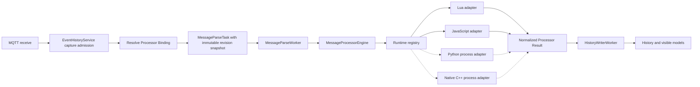

# Multi-language Message Processor Design

Status: Accepted; Phases 1-7 implemented

This document defines the target architecture for replacing the current Lua-only scripting subsystem with a language-neutral Message Processor platform. The first production runtimes are Lua and JavaScript. The storage model and runtime seam must allow Python and native C++ support to be added later without another domain or persistence redesign.

Related decisions:

- [ADR 0002: Store Message Processors as immutable SQLite revisions](docs/adr/0002-store-message-processors-as-immutable-sqlite-revisions.md)
- [ADR 0003: Run Python and native processors out of process](docs/adr/0003-run-python-and-native-processors-out-of-process.md)

The redesign deliberately does not preserve the existing script index, Lua filenames, mutable `ScriptEntry` model, `parse(ctx, const)` contract, or historical script fields. Existing connection and subscription settings remain outside the destructive scope, but old script bindings are ignored.

## 1. Goals

The design must:

- support Lua and JavaScript as equal first-class runtimes;
- use one language-neutral message-processing contract;
- keep processor identity separate from source language and runtime implementation;
- support immutable revisions and reproducible historical execution;
- support multiple source files from the first schema version;
- keep authoritative source data separate from derived runtime artifacts;
- isolate per-message mutable state;
- enforce bounded execution time, output size, diagnostics size, and source-package size;
- reuse the existing bounded `MessageParseWorker` queue and backpressure behavior;
- allow Python and C++ adapters without changing subscriptions, message history, or the external execution interface;
- make runtime-specific preparation, compilation, caching, interruption, and result conversion internal to one deep module;
- provide common conformance tests that every runtime adapter must pass.

## 2. Non-goals

The first delivery will not:

- migrate the current `index.json` or `.lua` files;
- preserve the current `ScriptEntry`, `ScriptService`, or `ScriptStore` interfaces;
- emulate Node.js, browser APIs, MQTTX, npm, or a general automation environment;
- support asynchronous processor entry points or Promises;
- install third-party Lua or JavaScript packages;
- compile or execute Python or C++ processors;
- provide a hard in-process memory limit for Lua or `QJSEngine`;
- load user-built C++ dynamic libraries into the main application process;
- guarantee a throughput improvement without a comparable traffic benchmark.

## 2.1 Current replacement map

The redesign replaces the current language-specific surfaces as follows:

| Current surface | Current limitation | Target ownership |
|---|---|---|
| [`ScriptEntry`](src/domain/script.h) | one mutable `code` string and no language/runtime identity | `ProcessorDefinition` plus immutable `ProcessorRevisionSnapshot` |
| [`ScriptStore`](src/services/storage/scriptstore.cpp) | `index.json`, one loose `.lua` file, Lua template and filename rules | transactional `ProcessorLibraryStore` in `library.db` |
| [`ScriptService`](src/usecases/scriptservice.cpp) | mutable upsert keyed by script ID | asynchronous `ProcessorLibrary` commands and immutable snapshots |
| [`LuaRunner`](src/services/scripting/luarunner.cpp) | production callers know the concrete runtime | internal Lua adapter behind `MessageProcessorEngine` |
| [`MessageParseTask`](src/domain/messageenvelope.h) | copies script ID, name, and source into every task | shared immutable revision snapshot plus binding parameters |
| [`SubscriptionEntry::scriptId`](src/domain/subscription.h) | cannot pin a version or carry parameters | `ProcessorReference` |
| [`MessageRecord::scriptId`](src/domain/messagerecord.h) | does not identify the executed source version | processor/revision/runtime identity snapshot |
| [`ScriptsView.qml`](qml/features/scripts/ScriptsView.qml) | Lua-specific labels and single-code editor | Processor Library and revision editor |

## 3. Domain language

The canonical domain terms are recorded in `CONTEXT.md`.

### 3.1 Message Processor

A Message Processor is the stable, application-wide identity selected by users and subscriptions. Its identity does not change when its name, description, source code, language, or runtime changes.

### 3.2 Processor Revision

A Processor Revision is an immutable saved source package. Saving edited source creates a new revision. Existing revisions are never rewritten.

### 3.3 Processor Binding

A Processor Binding belongs to a subscription. It either follows the processor's current revision or remains pinned to one specific revision. The binding may also contain per-subscription parameters.

### 3.4 Processor Result

A Processor Result is the normalized structured value or failure produced by applying one specific Processor Revision to one MQTT message.

## 4. Core design decisions

### 4.1 Use Message Processor rather than Script as the root concept

Lua, JavaScript, and Python are scripting languages, but C++ is not. Treating the language as the aggregate root would spread language-specific conditions into subscriptions, history, storage, UI, and tests. The root concept is therefore the behavior being configured: processing an MQTT message.

### 4.2 Separate contract, language, and runtime identities

Every revision stores three stable string identifiers:

- `contractId`: the behavior contract, initially `mqtt-plus.message-processor/v1`;
- `languageId`: the source language, such as `lua`, `javascript`, `python`, or `cpp`;
- `runtimeId`: the implementation that executes that language, such as `lua-5.5`, `qt-qjs`, `cpython`, or `native-cpp-v1`.

These are strings in storage, wrapped by validated value types in C++. They are not integer enum ordinals and are not inferred from filenames. This permits a future JavaScript revision to move from `qt-qjs` to another engine without pretending it changed language.

### 4.3 Make revisions immutable

Mutable source keyed only by processor ID creates cache invalidation races and makes historical execution ambiguous. Immutable revisions provide these invariants:

- a message resolves a revision exactly once when it enters the parse pipeline;
- editing a processor cannot alter tasks already queued;
- runtime caches are keyed by immutable content and need no public invalidation operation;
- a historical message can identify exactly which source package produced its result;
- pinned bindings remain stable while follow-current bindings advance intentionally.

### 4.4 Store authoritative source in SQLite

The Processor Library uses a dedicated SQLite database containing processor metadata, immutable revisions, and source files. SQLite is preferred over an index file plus loose source files because the library needs atomic multi-file revision creation, referential integrity, transactional current-revision changes, and deterministic recovery.

Source packages can later be exported to or imported from a file-based archive, but exported files are not the authoritative in-place store.

### 4.5 Keep runtime artifacts outside the library

Compiled Lua data, JavaScript preparation data, Python bytecode/environments, and C++ binaries are derived artifacts. They are placed under `QStandardPaths::CacheLocation`, keyed by runtime fingerprint and revision content hash, and may be deleted at any time.

### 4.6 Run Python and C++ outside the main process

Lua and JavaScript initially execute in the existing parse worker thread. Python and C++ are planned as helper-process adapters. This prevents the CPython GIL, Python package environments, native crashes, and C++ ABI failures from becoming part of the main application's lifetime and thread model.

## 5. Architecture



The main external seam is `MessageProcessorEngine`. Callers do not select language-specific classes, compile source, manage interpreter state, or convert results.

## 6. Domain types

The following shapes describe the intended semantics. Exact Qt container choices can be adjusted during implementation without changing the model.

```cpp
using ProcessorId = StrongStringId<struct ProcessorIdTag>;
using ProcessorRevisionId = StrongStringId<struct ProcessorRevisionIdTag>;
using ProcessorContractId = StrongStringId<struct ProcessorContractIdTag>;
using ProcessorLanguageId = StrongStringId<struct ProcessorLanguageIdTag>;
using ProcessorRuntimeId = StrongStringId<struct ProcessorRuntimeIdTag>;

struct ProcessorDefinition
{
    ProcessorId id;
    QString name;
    QString description;
    std::optional<ProcessorRevisionId> currentRevisionId;
    QDateTime createdAt;
    QDateTime updatedAt;
    std::optional<QDateTime> archivedAt;
};

struct ProcessorSourceFile
{
    QString path;
    QString mediaType;
    QByteArray content;
    QByteArray contentHash;
};

struct ProcessorRevisionSnapshot
{
    ProcessorRevisionId id;
    ProcessorId processorId;
    qint64 revisionNumber = 0;
    ProcessorContractId contractId;
    ProcessorLanguageId languageId;
    ProcessorRuntimeId runtimeId;
    QString entryFile;
    QString entrySymbol;
    QCborMap manifest;
    QByteArray contentHash;
    QVector<ProcessorSourceFile> files;
    QDateTime createdAt;
};

enum class ProcessorRevisionMode
{
    FollowCurrent,
    Pinned,
};

struct ProcessorReference
{
    ProcessorId processorId;
    ProcessorRevisionMode revisionMode = ProcessorRevisionMode::FollowCurrent;
    std::optional<ProcessorRevisionId> pinnedRevisionId;
    QCborMap parameters;
};
```

Revision snapshots are immutable and safe to share across threads through `QSharedPointer<const ProcessorRevisionSnapshot>` or an equivalent immutable ownership type.

## 7. Execution contract

### 7.1 Contract identifier

The first contract is:

```text
mqtt-plus.message-processor/v1
```

Contract versioning is independent of language and runtime versioning. A future incompatible context or result model receives a new contract ID rather than hidden conditional behavior.

### 7.2 Entry point

Every source package exposes one synchronous entry point named `process` by default:

```text
process(context) -> value
```

The entry symbol is stored explicitly so future contracts or imported packages can choose another symbol without changing the schema.

JavaScript example:

```javascript
function process(context) {
    const view = new DataView(
        context.payload.buffer,
        context.payload.byteOffset,
        context.payload.byteLength
    )
    return {
        topic: context.topic,
        value: view.getUint16(0, true)
    }
}
```

Lua example:

```lua
function process(context)
    return {
        topic = context.topic,
        payloadSize = #context.payload
    }
end
```

### 7.3 Message context

The language-neutral C++ context contains:

```cpp
struct MessageProcessorContext
{
    QString topic;
    QByteArray payload;
    QString receivedAt;
    QString format;
    QString decoded;
    QString decodeError;
    QCborMap parameters;
};
```

Adapters expose idiomatic values:

| Field | JavaScript | Lua | Python | C++ |
|---|---|---|---|---|
| `payload` | `Uint8Array` | binary string | `bytes` | byte span |
| maps | plain object | table | `dict` | CBOR map/view |
| arrays | array | table | `list` | CBOR array/view |
| integers | number or host integer helper | integer | `int` | fixed-width integer |

Session objects, QObjects, MQTT clients, file handles, settings, and application modules are never exposed to processor code.

### 7.4 Processor value

Adapter return values are normalized to `QCborValue`. Supported logical types are:

- null;
- boolean;
- signed and unsigned integers representable by CBOR;
- floating-point number;
- UTF-8 string;
- byte array;
- array;
- map with string keys.

Unsupported values, functions, handles, userdata, cyclic graphs, excessive nesting, or excessive collection sizes produce a structured execution failure.

The engine creates a bounded display preview separately. The preview is not the authoritative result.

### 7.5 Execution result

```cpp
enum class ProcessorExecutionState
{
    Succeeded,
    InvalidSource,
    RuntimeUnavailable,
    PreparationFailed,
    ExecutionFailed,
    TimedOut,
    Cancelled,
    OutputLimitExceeded,
    UnsupportedResult,
    InternalError,
};

struct ProcessorDiagnostic
{
    QString code;
    QString message;
    QString file;
    int line = -1;
    int column = -1;
};

struct ProcessorExecutionResult
{
    ProcessorExecutionState state = ProcessorExecutionState::InternalError;
    QCborValue value;
    QString preview;
    QVector<ProcessorDiagnostic> diagnostics;
    qint64 durationMicroseconds = 0;
};
```

Runtime-specific exception text is converted into stable diagnostic codes plus bounded user-facing details.

## 8. MessageProcessorEngine interface

The external interface contains only operations required by callers and tests:

```cpp
class MessageProcessorEngine
{
public:
    ValidationResult validate(
        const ProcessorRevisionSnapshot &revision,
        const ProcessorExecutionLimits &limits);

    ProcessorExecutionResult execute(
        const ProcessorRevisionSnapshot &revision,
        const MessageProcessorContext &context,
        const ProcessorExecutionLimits &limits);
};
```

The implementation owns:

- runtime selection;
- source-package validation;
- runtime availability checks;
- preparation and compilation;
- prepared-artifact caching;
- fresh per-message execution environments;
- watchdogs and interruption;
- language-specific context conversion;
- result normalization;
- diagnostic normalization;
- artifact cleanup and LRU policy;
- metrics.

There is intentionally no public `clearCache()` operation. Cache identity derives from immutable revision content and runtime fingerprint. Administrative cache deletion is a separate maintenance action, not part of message execution.

## 9. Runtime adapter seam

Lua and JavaScript provide two real adapters, so an internal runtime seam is justified.

```cpp
class ProcessorRuntimeAdapter
{
public:
    virtual RuntimeDescriptor descriptor() const = 0;

    virtual ProcessorPreparationResult prepare(
        const ProcessorRevisionSnapshot &revision,
        const ProcessorExecutionLimits &limits) = 0;

    virtual ProcessorExecutionResult execute(
        const PreparedProcessor &prepared,
        const MessageProcessorContext &context,
        const ProcessorExecutionLimits &limits) = 0;
};
```

`PreparedProcessor` is an internal type-erased immutable handle. It is never stored in domain objects or exposed to view models.

The runtime registry maps `runtimeId` to one adapter and verifies that the adapter supports the revision's `languageId` and `contractId`.

## 10. Runtime descriptors

Runtime capabilities are code-defined and discovered from installed adapters rather than persisted as user data.

```cpp
struct RuntimeDescriptor
{
    ProcessorRuntimeId runtimeId;
    ProcessorLanguageId languageId;
    QString displayName;
    QString runtimeVersion;
    QStringList supportedContractIds;
    QStringList sourceExtensions;
    RuntimeExecutionMode executionMode;
};
```

The initial registry contains:

| Runtime ID | Language ID | Execution mode | Initial status |
|---|---|---|---|
| `lua-5.5` | `lua` | parse worker thread | implemented in first delivery |
| `qt-qjs` | `javascript` | parse worker thread | implemented in first delivery |
| `cpython` | `python` | helper process | reserved |
| `native-cpp-v1` | `cpp` | helper process | reserved |

Adding a runtime changes the registry and adapter implementation, not the database schema or subscription model.

## 11. Processor Library storage

### 11.1 Location

The authoritative database is stored under the application configuration directory:

```text
<GenericConfigLocation>/mqtt_plus/processors/library.db
```

The store uses:

- `PRAGMA foreign_keys = ON`;
- WAL journal mode;
- a bounded busy timeout;
- explicit transactions for every mutation;
- `PRAGMA user_version` for schema versioning;
- one connection owned by the library storage thread.

`QSqlDatabase` connections are never shared across threads.

### 11.2 Schema

The initial schema is conceptually:

```sql
CREATE TABLE processors (
    id TEXT PRIMARY KEY,
    name TEXT NOT NULL,
    description TEXT NOT NULL DEFAULT '',
    current_revision_id TEXT,
    created_at TEXT NOT NULL,
    updated_at TEXT NOT NULL,
    archived_at TEXT,
    FOREIGN KEY(current_revision_id)
        REFERENCES processor_revisions(id)
        ON DELETE SET NULL
        DEFERRABLE INITIALLY DEFERRED
);

CREATE TABLE processor_revisions (
    id TEXT PRIMARY KEY,
    processor_id TEXT NOT NULL,
    revision_number INTEGER NOT NULL CHECK(revision_number > 0),
    contract_id TEXT NOT NULL,
    language_id TEXT NOT NULL,
    runtime_id TEXT NOT NULL,
    entry_file TEXT NOT NULL,
    entry_symbol TEXT NOT NULL,
    manifest_json TEXT NOT NULL DEFAULT '{}',
    content_hash TEXT NOT NULL,
    created_at TEXT NOT NULL,
    FOREIGN KEY(processor_id)
        REFERENCES processors(id)
        ON DELETE CASCADE,
    UNIQUE(processor_id, revision_number),
    UNIQUE(processor_id, content_hash)
);

CREATE TABLE processor_files (
    revision_id TEXT NOT NULL,
    path TEXT NOT NULL,
    media_type TEXT NOT NULL,
    content BLOB NOT NULL,
    content_hash TEXT NOT NULL,
    PRIMARY KEY(revision_id, path),
    FOREIGN KEY(revision_id)
        REFERENCES processor_revisions(id)
        ON DELETE CASCADE
);

CREATE INDEX idx_processor_revisions_processor_number
    ON processor_revisions(processor_id, revision_number DESC);

CREATE INDEX idx_processors_active_name
    ON processors(archived_at, name COLLATE NOCASE);
```

The implementation must create tables in a transaction and validate that `current_revision_id`, when present, belongs to the same processor. SQLite cannot express that cross-column ownership condition using only the shown foreign key, so it must be enforced by a trigger or by store invariants covered by tests.

### 11.3 Why source files are rows

Storing files as rows provides:

- atomic creation of an entire multi-file revision;
- exact retention of the source used by historical results;
- binary resource support;
- no partially renamed directories;
- no index/file disagreement;
- deterministic package hashing;
- easy in-memory immutable snapshots.

An export command may materialize the package as files for external editing. Importing an export always creates a new revision or a new processor; it never edits stored file rows in place.

### 11.4 Source path rules

Every source path must:

- be a normalized relative path;
- use `/` as the logical separator;
- contain no empty segments, `.` segments, or `..` segments;
- not start with `/`, a drive prefix, or a URI scheme;
- be unique within the revision after case normalization rules appropriate to the platform-neutral package model;
- remain within configured file-count and package-size limits.

The entry file must identify one stored source file.

### 11.5 Canonical content hash

`contentHash` is SHA-256 over a canonical byte stream containing:

1. contract ID;
2. language ID;
3. runtime ID;
4. entry file;
5. entry symbol;
6. canonical manifest content;
7. every file sorted by normalized path, including path length, path bytes, content length, and raw content bytes.

Processor name, description, timestamps, current-revision selection, and subscription parameters are excluded because they do not affect executable behavior.

### 11.6 Saving a revision

One transaction performs:

1. validate metadata and source-package limits;
2. canonicalize paths and manifest;
3. calculate file hashes and package hash;
4. create the processor row if needed with no current revision;
5. return the existing revision if the same processor already has the same content hash;
6. allocate the next revision number;
7. insert the revision and all file rows;
8. update `processors.current_revision_id` and metadata;
9. commit;
10. publish a new immutable library snapshot to the UI.

Failure before commit leaves the database and visible library unchanged.

### 11.7 Archiving and deletion

Normal deletion archives a processor by setting `archived_at`. Archived processors disappear from new-binding choices but their revisions remain available to pinned bindings and historical inspection.

Permanent purge is a separate explicit operation. It must refuse to remove a processor or revision while a current subscription binding references it. Historical message rows live in another database and cannot provide a cross-database foreign key, so the product must either retain all historical revisions or perform an explicit reference audit before purge. The initial delivery retains revisions indefinitely.

## 12. Runtime artifact cache

Derived artifacts live under:

```text
<CacheLocation>/mqtt_plus/processors/
    <runtime-id>/
        <runtime-fingerprint>/
            <content-hash>/
                artifact...
                diagnostics.json
                artifact.json
```

The runtime fingerprint includes every factor that can invalidate preparation:

- runtime implementation and version;
- processor contract ABI version;
- Qt version where relevant;
- Python ABI where relevant;
- application native processor ABI;
- operating system;
- CPU architecture;
- compiler/toolchain identity for C++.

Artifact writes use a temporary directory followed by an atomic rename. An artifact directory without a valid final manifest is ignored. The entire cache may be deleted without losing processors.

Lua and JavaScript may use memory-only prepared caches initially. Python and C++ require disk artifacts because preparation can be expensive.

## 13. Processor Library module

The library module owns persistence and publishes immutable snapshots. Its external interface should describe user operations rather than database tables:

```cpp
class ProcessorLibrary
{
public:
    void load();
    void createProcessor(const CreateProcessorCommand &command);
    void saveRevision(const SaveProcessorRevisionCommand &command);
    void archiveProcessor(const ProcessorId &id);
    void restoreProcessor(const ProcessorId &id);

    QSharedPointer<const ProcessorLibrarySnapshot> snapshot() const;
    QSharedPointer<const ProcessorRevisionSnapshot> resolve(
        const ProcessorReference &reference) const;
};
```

Mutations are serialized on a dedicated storage worker. The visible snapshot changes only after the durable transaction commits.

## 14. Parse pipeline integration

### 14.1 Resolve at admission time

When an incoming message is admitted for capture:

1. match the subscription;
2. read its `ProcessorReference`;
3. resolve the actual revision from the current immutable library snapshot;
4. place a shared pointer to that revision in `MessageParseTask`;
5. write processor identity and revision identity into the pending `MessageRecord`;
6. enqueue the parse task.

This guarantees that changing the current revision while messages are queued does not change which code they execute.

### 14.2 Task shape

```cpp
struct MessageParseTask
{
    MessageEnvelope envelope;
    QSharedPointer<const ProcessorRevisionSnapshot> processorRevision;
    QCborMap processorParameters;
};
```

The task no longer copies mutable source code, script name, or script ID per message. The immutable shared snapshot avoids repeated multi-file package copies.

### 14.3 Worker ownership

`MessageParseWorker` owns one `MessageProcessorEngine`. Runtime objects are created, used, and destroyed on the worker thread unless an adapter explicitly uses a helper process.

The existing queue limits, pressure states, draining behavior, and parser-before-writer shutdown order remain pipeline invariants.

### 14.4 Missing and unavailable processors

- no binding: perform ordinary payload decoding;
- unresolved processor: persist a failed result with `processor_not_found`;
- runtime not installed: persist `runtime_unavailable`;
- revision invalid: persist `invalid_source` or `preparation_failed`;
- queue overloaded: retain the actual processor revision identity and persist `skipped_overload`.

## 15. History storage

The current `script_id`, `script_name`, and string-only parsed result are replaced. The message row stores execution identity snapshots because the Processor Library and history database have independent lifecycles.

Recommended fields are:

```sql
processor_id TEXT NOT NULL DEFAULT '',
processor_revision_id TEXT NOT NULL DEFAULT '',
processor_name TEXT NOT NULL DEFAULT '',
processor_language_id TEXT NOT NULL DEFAULT '',
processor_runtime_id TEXT NOT NULL DEFAULT '',
processor_content_hash TEXT NOT NULL DEFAULT '',
processor_result_cbor BLOB,
processor_result_preview TEXT NOT NULL DEFAULT '',
processor_execution_state TEXT NOT NULL DEFAULT 'not_required',
processor_execution_error_code TEXT NOT NULL DEFAULT '',
processor_execution_error TEXT NOT NULL DEFAULT '',
processor_execution_duration_us INTEGER NOT NULL DEFAULT 0
```

The authoritative structured value is deterministic CBOR. The preview is bounded display text and may be regenerated when rendering rules change.

Because compatibility is not required, the implementation may recreate only `mqtt_messages` when the required processor columns are missing. It must not delete session, connection, subscription, event-log, publish-draft, or Processor Library data as a side effect.

## 16. Subscription storage

`SubscriptionEntry::scriptId` is replaced by a `ProcessorReference` value.

The persisted subscription representation is conceptually:

```json
{
  "processor": {
    "processorId": "uuid",
    "revisionMode": "current",
    "revisionId": null,
    "parametersCborBase64": "..."
  }
}
```

When `revisionMode` is `pinned`, `revisionId` is mandatory and must belong to `processorId`. When it is `current`, `revisionId` is omitted.

Old `scriptId` values are ignored rather than migrated. Other subscription fields remain intact.

## 17. Lua adapter

The existing Lua implementation can be reused internally, but its public contract changes.

The Lua adapter must:

- require `function process(context)`;
- expose only an allowlisted Lua standard library;
- expose raw payload as a binary string;
- expose a non-forgeable `null` sentinel for null array entries;
- expose `bytes(value)` when a Lua string must be returned as a CBOR byte array rather than UTF-8 text;
- create a fresh Lua state and mutable environment for each message;
- cache only immutable prepared data keyed by revision content hash;
- normalize return tables recursively into CBOR;
- reject cycles, functions, userdata, unsupported keys, excessive depth, and excessive entries;
- preserve protected-call error containment;
- interrupt or fail execution after the configured instruction/time budget;
- bound diagnostics and output.

The old `constants()` convention is removed. Protocol tables may live in additional Lua source files or in the revision manifest. A first implementation may load files into one revision-local module environment while still creating a fresh message environment.

## 18. JavaScript adapter

The JavaScript adapter uses `QJSEngine` and must:

- require synchronous `function process(context)`;
- expose raw payload as `Uint8Array`;
- expose plain JavaScript objects and arrays rather than QObjects;
- avoid exposing Qt application objects or context properties;
- create an isolated engine or equivalently clean realm per execution;
- use a watchdog from another thread to call `QJSEngine::setInterrupted(true)` on timeout;
- clear the interrupted state before any later use;
- normalize JavaScript primitives, arrays, objects, and array buffers into CBOR;
- reject functions, symbols, Promises, cyclic objects, excessive depth, and excessive output;
- capture bounded source locations and stack text for diagnostics;
- treat missing browser or Node APIs as intentional, not as compatibility bugs.

`QJSEngine` does not provide a dependable hard heap limit. A fresh environment, payload limits, source-package limits, timeout interruption, output limits, and queue backpressure reduce risk but do not create a hard memory sandbox. If hard memory isolation becomes a requirement, JavaScript must move to a helper process without changing the engine interface or storage model.

The Phase 4 implementation keeps only validated, decoded source files in the
prepared cache because `QJSEngine` has no public portable bytecode interface.
Preparation and every message execution use a fresh engine. A hidden bootstrap
captures pristine JavaScript intrinsics before processor source runs; it creates
`Uint8Array` context values, distinguishes returned values from thrown values,
and normalizes results without invoking object accessors. The watchdog remains
active through source evaluation, `process(context)`, and result inspection, so
an infinite loop in either processor logic or a hostile `Proxy` trap is
interrupted. `Uint8Array` views and `ArrayBuffer` values become CBOR byte arrays;
Promises and other non-plain objects are rejected as unsupported synchronous
results. No QObject, QML context, application singleton, console extension, or
Node/browser bridge is installed in the engine.

## 19. Python adapter plan

Python support is reserved but shaped now:

- use a versioned helper executable rather than embedding CPython in the GUI process;
- communicate using framed CBOR messages over local IPC;
- materialize immutable revision files into a content-addressed environment directory;
- use one controlled environment per dependency lock hash, not an unrestricted global environment;
- disable network package installation during message execution;
- prepare dependencies before a revision becomes locally ready;
- enforce wall-clock timeout by terminating or recycling the worker process;
- cap process memory and output using platform facilities where available;
- convert Python `None`, `bool`, `int`, `float`, `str`, `bytes`, `list`, and string-keyed `dict` to CBOR;
- treat imports and dependencies as manifest-declared capabilities.

The initial database already supports Python multi-file packages and dependency metadata through `processor_files` and `manifest_json`.

## 20. Native C++ adapter plan

C++ processors are trusted native extensions, not ordinary scripts. The adapter must:

- compile source outside the message hot path;
- target a stable C ABI, never the application's C++ or Qt ABI;
- exchange context and results using encoded CBOR buffers;
- load compiled libraries only inside a helper process;
- include application processor ABI, compiler, OS, and architecture in the runtime fingerprint;
- refuse artifacts whose ABI manifest does not match;
- restart the helper after crashes or protocol violations;
- require explicit user trust before compiling or executing native source;
- never expose main-process pointers or Qt objects.

A conceptual native entry point is:

```c
int mqtt_plus_process_v1(
    const unsigned char *request_cbor,
    size_t request_size,
    unsigned char **result_cbor,
    size_t *result_size,
    mqtt_plus_allocator_v1 allocator);
```

The precise ABI belongs in a future contract document before C++ implementation begins.

## 21. Execution limits

Initial limits should be explicit configuration owned by the engine, not scattered constants in adapters.

Recommended starting values:

| Limit | Initial value |
|---|---:|
| source files per revision | 64 |
| total source-package bytes | 2 MiB |
| one source file | 1 MiB |
| manifest bytes | 64 KiB |
| per-message wall time | 50 ms |
| maximum configurable wall time | 500 ms |
| normalized result CBOR | 256 KiB |
| diagnostics text | 16 KiB |
| result nesting | 32 |
| map/array entries | 100,000 |

These are safety defaults, not proven performance thresholds. They must be exercised against representative payloads and traffic before release.

## 22. Validation and readiness

Source validity and local runtime readiness are different:

- source validity asks whether the package satisfies its language and contract rules;
- local readiness asks whether this machine has a compatible runtime and prepared artifact.

Revision source data remains immutable regardless of local readiness. Machine-specific readiness is derived from the runtime registry and artifact cache, not treated as authoritative domain data.

Saving a revision performs structural validation. The UI then schedules runtime preparation. A revision may be saved but not selectable for new bindings until its current machine status is ready. Existing pinned bindings surface a clear unavailable state if their runtime later disappears.

## 23. UI design

The current Script Manager becomes Processor Library.

### 23.1 Processor list

Each row shows:

- processor name;
- language badge;
- current revision number;
- local readiness status;
- archived state when applicable;
- updated timestamp.

Filtering searches name, description, language, and source text maintained by the model rather than QML delegate scans.

### 23.2 Editor

Creating a processor requires selecting a language/runtime template. The first UI may expose one editable entry file for Lua and JavaScript, while the storage and view-model interfaces already represent a file collection.

The editor shows:

- name and description;
- language and runtime;
- entry file and entry symbol;
- source files;
- binding-parameter schema when introduced;
- validation diagnostics;
- revision history;
- Save Revision action.

Changing the language creates a new revision template; it does not rewrite an existing revision.

### 23.3 Subscription binding

The subscription editor selects:

- no processor;
- a processor following its current revision;
- a specific pinned revision.

Only locally ready revisions are selectable by default. Missing or unavailable existing bindings remain visible with an explanation rather than silently selecting another processor.

## 24. Error model

Stable error codes are required for UI, storage, and tests. Initial codes include:

- `processor_not_found`;
- `revision_not_found`;
- `runtime_unavailable`;
- `contract_unsupported`;
- `invalid_manifest`;
- `invalid_entry_file`;
- `invalid_source`;
- `preparation_failed`;
- `execution_failed`;
- `execution_timed_out`;
- `execution_cancelled`;
- `unsupported_result`;
- `result_limit_exceeded`;
- `diagnostics_truncated`;
- `parser_queue_overloaded`;
- `internal_runtime_error`.

Adapters may attach language-specific details, but callers branch only on stable engine codes.

## 25. Security model

The first delivery assumes processors are local user-authored code, but still applies least privilege:

- no filesystem, network, process, settings, credential, or MQTT client objects exposed to Lua or JavaScript;
- source paths are strictly normalized;
- source, result, diagnostics, nesting, and execution time are bounded;
- runtime state is isolated between messages;
- processor execution stays off the MQTT receive and GUI threads;
- native and Python execution is planned out of process;
- imported processor packages are treated as untrusted until explicitly reviewed;
- native source requires a stronger trust confirmation than Lua or JavaScript;
- secret connection data is never included in `MessageProcessorContext`.

This is not an OS sandbox for in-process Lua or JavaScript. The product must not describe it as one.

## 26. Observability

The engine records bounded aggregate metrics by runtime:

- validation and preparation duration;
- execution count;
- execution duration distribution;
- success and failure counts by stable error code;
- timeout count;
- prepared-cache hits and misses;
- helper-process restarts;
- result-limit failures;
- parse queue skips and drops.

Per-message processor diagnostics are stored only with the associated history result. They are not duplicated into an unbounded global log.

No performance claim is accepted from build and unit-test success alone. Before release, run a fixed traffic profile comparing:

- no processor;
- equivalent Lua processor;
- equivalent JavaScript processor;
- processor failures and timeouts;
- mixed subscriptions;
- queue pressure and shutdown drain.

## 27. Test strategy

The external interfaces are the primary test surface.

### 27.1 Processor Library tests

- create a processor and first revision atomically;
- create another revision without mutating the first;
- avoid duplicate revisions for identical content;
- reject invalid paths and duplicate normalized paths;
- validate entry-file ownership;
- preserve the visible snapshot after failed commits;
- resolve current and pinned references;
- prevent cross-processor pinned revisions;
- archive without removing revisions;
- reopen the database and reproduce hashes and snapshots;
- reject unsupported newer schema versions without overwriting them.

### 27.2 Common runtime conformance suite

Run the same behavior suite against Lua and JavaScript adapters:

- access every context field;
- return every supported value type;
- return nested maps and arrays;
- return byte arrays;
- reject cyclic and unsupported results;
- enforce result size, nesting, and entry limits;
- isolate mutable state between messages;
- replace no immutable revision state;
- report syntax errors with source location;
- report runtime exceptions;
- time out infinite execution;
- recover after a failed or timed-out message;
- preserve Unicode strings and binary zero bytes;
- produce equivalent CBOR for equivalent processors.

### 27.3 Pipeline tests

- resolve a revision before enqueueing;
- keep the resolved revision when current revision changes while queued;
- persist processor identity before parsing completes;
- preserve processor identity on overload skips;
- publish visible results only after writer admission;
- drain parser before final writer drain;
- keep subscription bindings stable across session reload;
- reset only message history for incompatible history schema.

### 27.4 UI and architecture tests

- QML uses Processor terminology rather than generic Script terminology;
- runtime choices come from the runtime catalog;
- view models own editor commands and validation state;
- no QML file scans the full source library to filter rows;
- unavailable bindings remain visible;
- the composition root owns library worker, engine, and runtime adapters;
- QML never receives runtime adapter objects.

## 28. Target source organization

The target layout is:

```text
src/domain/
    messageprocessor.h
    processorreference.h
    processorexecution.h

src/services/processors/
    processorlibrary.h/.cpp
    processorlibrarystore.h/.cpp
    processorlibraryworker.h/.cpp
    messageprocessorengine.h/.cpp
    processorruntimeadapter.h
    processorruntimeregistry.h/.cpp
    processorpackagehash.h/.cpp
    runtimes/
        luaruntimeadapter.h/.cpp
        javascriptruntimeadapter.h/.cpp

src/models/
    processorlibrarymodel.h/.cpp
    processorfiltermodel.h/.cpp
    processorrevisionmodel.h/.cpp

src/viewmodels/
    processorsviewmodel.h/.cpp
    processoreditorviewmodel.h/.cpp

qml/features/processors/
    ProcessorsView.qml
    ProcessorListPane.qml
    ProcessorEditor.qml
```

## 29. Implementation sequence

Each phase should remain buildable and independently reviewed.

### Phase 1: Domain and SQLite library

- add processor domain types;
- implement package normalization and hashing;
- implement SQLite schema and transactional store;
- add current and pinned reference resolution;
- add store and hashing tests;
- keep the old scripting subsystem temporarily untouched.

Exit criteria:

- library tests pass after database reopen;
- failed writes do not alter snapshots;
- identical packages produce identical hashes;
- no runtime code depends on database rows directly.

### Phase 2: Engine seam and runtime conformance harness

- add `MessageProcessorEngine`;
- add runtime registry and internal adapter interface;
- define normalized context, result, limits, and diagnostics;
- create a fake adapter only inside engine tests;
- add the shared conformance-test harness.

Exit criteria:

- callers know only the engine interface;
- runtime selection is based on stable IDs;
- cache keys use immutable revision identity.

### Phase 3: Lua adapter

- adapt safe Lua execution behind the new adapter;
- replace `parse(ctx, const)` with `process(context)`;
- convert Lua values to CBOR;
- enforce common limits and diagnostics;
- pass the common conformance suite.

Exit criteria:

- the new Processor Engine path does not reference `LuaRunner` directly;
- the legacy `MessageParseWorker` dependency on `LuaRunner` remains isolated until the Phase 5 task-shape cutover;
- mutable state is isolated between messages;
- timeout and hostile-result tests pass.

### Phase 4: JavaScript adapter

- link `Qt6::Qml` explicitly where required;
- implement context conversion and `Uint8Array` payload;
- implement watchdog interruption;
- implement CBOR result normalization;
- pass the same conformance suite as Lua.

Exit criteria:

- Lua and JavaScript equivalent fixtures produce equivalent CBOR;
- infinite loops time out and the next message succeeds;
- no QObject or application global is exposed.

### Phase 5: Message pipeline and history

- replace script fields in subscriptions, tasks, results, and message records;
- resolve immutable revision snapshots at capture admission;
- update history storage and rendering;
- reset only incompatible message history data;
- extend overload and shutdown tests.

Exit criteria:

- queued messages keep their original revision;
- parse-result writer ordering remains correct;
- no script source is copied into each task.

Implementation status (2026-08-05): complete. The capture path resolves current or pinned
references from the in-memory `ProcessorLibrary`, persists the six-field revision identity
before execution, sends immutable snapshots to `MessageParseWorker`, stores canonical CBOR
results and stable execution failures, and keeps processor identity on queue-pressure skips.
Subscription settings now use the nested Processor Reference representation with CBOR
parameters; legacy `scriptId` settings are ignored. Incompatible `mqtt_messages` tables are
recreated transactionally with message totals cleared while event logs remain intact.

Phase validation completed with generated `all_qmllint`, a full debug build, focused pipeline,
history, subscription, and architecture tests, and 38/38 CTest targets.

### Phase 6: Processor Library UI

- replace Script Manager with Processor Library;
- expose runtime catalog, language selection, revision save, and validation;
- replace subscription script selection with Processor Binding;
- add translations and QML architecture assertions.

Exit criteria:

- users can create, validate, save, bind, edit, and revision both Lua and JavaScript processors;
- pinned and follow-current bindings are distinguishable;
- unavailable bindings are not silently discarded.

Implementation status (2026-08-05): complete. The application root and navigation now
expose `ProcessorsViewModel` and Processor Library QML instead of the legacy Script Manager.
The library list presents language, current revision, readiness, archive state, and update
time; model-side filtering includes metadata, language, and current source. The editor can
create Lua 5.5 or Qt QJSEngine templates, validate through `MessageProcessorEngine`, preserve
unexposed files in multi-file packages, save immutable revisions, revisit revision history,
and archive or restore a processor.

Subscription editing now constructs a full `ProcessorReference`, distinguishes follow-current
and pinned bindings, preserves CBOR parameters, restricts normal choices to locally ready
revisions, and keeps missing, archived, or unavailable existing bindings visible with an
explanation. Chinese translations and architecture assertions cover the new surfaces.

Phase validation completed with generated `all_qmllint`, a full debug build, focused Processor
and subscription tests, and 39/39 CTest targets. The built macOS application launched without
QML warnings. Pixel/accessibility inspection was attempted but not completed because Orca
Computer Use reported an inconsistent macOS Accessibility permission state; this is not
counted as visual layout acceptance.

### Phase 7: Remove legacy scripting subsystem

- delete `ScriptEntry`, `ScriptStore`, `ScriptService`, script models, and legacy view models;
- delete old script QML and Lua-specific labels;
- remove obsolete tests after equivalent engine/library tests exist;
- leave old on-disk script files untouched but unused.

Exit criteria:

- repository search finds no production `scriptId`, `ScriptEntry`, or Lua-only product terminology;
- the new module passes the deletion test: removing it would force runtime, storage, revision, and result complexity back into multiple callers.

Implementation status (2026-08-06): complete. The obsolete Script domain entry,
filesystem store, use-case service, Lua runner production path, list/filter models,
editor/page ViewModels, QML feature directory, and their superseded tests were removed.
`Application` and `SessionService` no longer construct or depend on `ScriptService`, and
configuration transfer no longer carries or interprets the legacy subscription field.

The architecture deletion test now checks both the removed files and all production C++/QML
sources for legacy scripting tokens. Translation extraction removed the old Script Manager
contexts. Existing files in the former user script storage location are deliberately not
read, migrated, rewritten, or deleted.

Phase validation completed with generated `all_qmllint`, a full debug build, affected
configuration/session/application tests, and 35/35 CTest targets. The built macOS application
started without QML warnings; the startup check was not a visual layout acceptance pass.

### Phase 8: Hardening and benchmark

- run fixed traffic profiles;
- tune time, source, and result defaults using measurements;
- verify cache eviction and shutdown behavior;
- verify corrupt/unsupported database handling;
- complete package/import security review;
- document residual in-process memory risk.

## 30. Validation commands

For every implementation phase:

```bash
cmake --build --preset qt6.11-debug --target all_qmllint
cmake --build --preset qt6.11-debug
ctest --test-dir build/qt6.11-debug --output-on-failure
git diff --check
```

Also run the focused targets introduced by the phase before the full suite. UI phases require visible runtime verification; build and lint success alone do not establish interaction or layout correctness.

## 31. Acceptance criteria

The Lua and JavaScript delivery is complete when:

- Processor Library storage is the only authoritative processor store;
- saving always creates or reuses an immutable revision;
- source packages support multiple files even if the initial editor exposes one;
- subscriptions support follow-current and pinned references;
- messages store the exact executed revision and normalized CBOR result;
- Lua and JavaScript pass the same runtime conformance suite;
- execution occurs outside MQTT receive and GUI threads;
- timeouts, overloads, invalid source, unsupported results, and missing runtimes are persisted as stable states;
- editing a processor cannot alter queued messages;
- cache invalidation requires no caller action;
- adding a registered Python or C++ adapter would not require a schema, binding, history, or engine-interface change;
- current scripts are not migrated and old script files are not treated as the new library;
- message-table replacement does not affect sessions, subscriptions, logs, drafts, or the Processor Library;
- full build, QML lint, CTest, diff checks, and visible UI verification pass.

## 32. Decisions intentionally deferred

The following do not block Lua and JavaScript delivery:

- the import/export package archive format;
- dependency installation UX;
- processor sharing or marketplace support;
- cryptographic package signatures;
- the native C processor ABI details;
- the Python environment resolver;
- OS-level sandbox profiles;
- historical re-execution UI;
- configurable per-processor execution budgets;
- multi-file code-editor UX beyond the storage and view-model model.

These features must build on the stored contract, revision, source-package, artifact, and adapter concepts rather than adding language-specific fields to subscriptions or message history.
