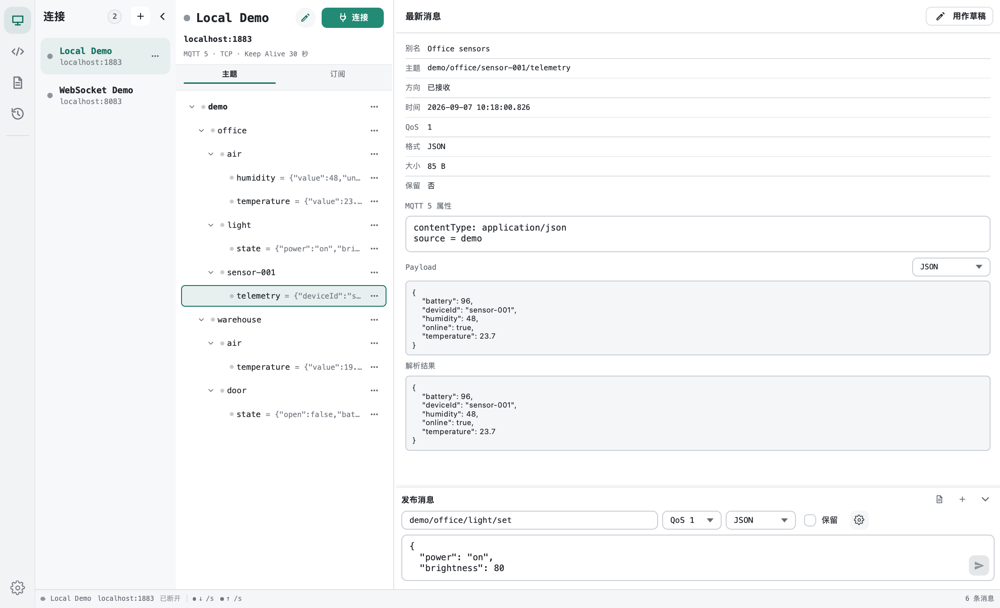
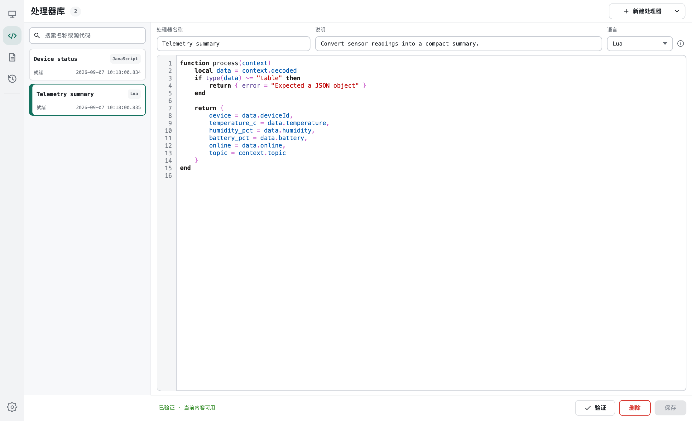
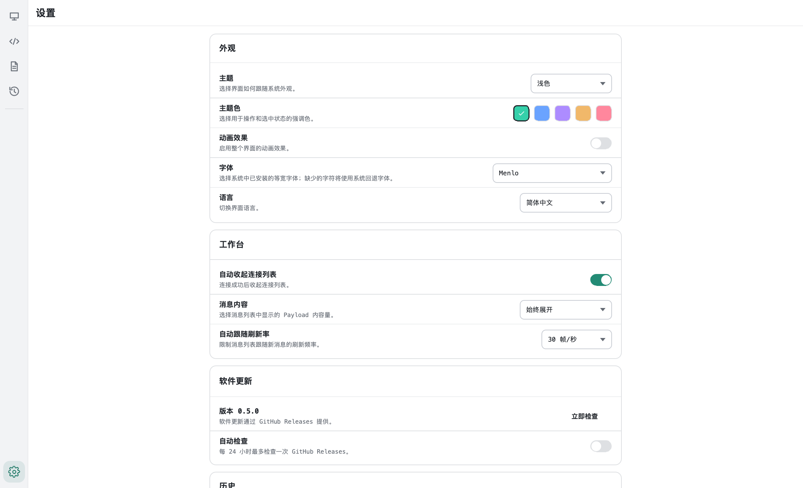

# MQTT Plus

[](https://github.com/zouri/mqtt-plus/actions/workflows/build-packages.yml)

[English](README.en.md) | 简体中文

MQTT Plus 是面向 MQTT 开发、联调和问题定位的跨平台桌面客户端。它将多连接管理、订阅与发布、持久化消息流和可编程载荷处理集中在一个本地工作台中。

[下载最新版本](https://github.com/zouri/mqtt-plus/releases/latest) · [快速开始](#下载与快速开始) · [提交问题](https://github.com/zouri/mqtt-plus/issues)



## 为什么选择 MQTT Plus

- **集中完成 MQTT 调试**：在同一个工作台中管理多个连接、订阅主题、检查消息并构造发布请求。
- **让载荷更容易理解**：直接查看常用文本和二进制格式，也可以为订阅绑定 Lua 或 JavaScript 处理器。
- **保留可复现的调试上下文**：本地保存消息、日志、发布草稿、处理器版本和连接配置。

## 下载与快速开始

[GitHub Releases](https://github.com/zouri/mqtt-plus/releases) 提供以下安装包：

| 平台 | 安装包 |
| --- | --- |
| Windows x64 | NSIS 安装程序（`.exe`） |
| Linux x64 | Debian 包（`.deb`）和 AppImage |
| macOS | Intel x64 和 Apple Silicon arm64（`.dmg`） |

1. 从 Releases 下载并安装适合当前平台的软件包。
2. 启动 MQTT Plus，新建连接并填写 Broker 地址、端口，以及需要的认证或 TLS 设置。
3. 连接后添加订阅，选择 QoS 和载荷格式，即可查看消息流。
4. 使用底部发布编辑器发送消息；需要自定义解析时，为订阅绑定消息处理器。

MQTT Plus 不包含内置 Broker，开始前需要一个可以访问的 MQTT Broker。

## 功能

- MQTT 5.0 和 MQTT 3.1.1，支持 TCP、TLS、用户名密码、服务端证书校验和客户端证书。
- 多连接管理；QoS 0/1/2 订阅与发布；支持 Retain、订阅暂停和消息筛选。
- Plaintext、JSON、Base64、Hex、CBOR、MsgPack 载荷编解码。
- 消息与运行日志分开保存到 SQLite，可分页查看、筛选和清理。
- 发布草稿、最近发布记录，以及从消息快速创建草稿。
- Lua 5.5 和 JavaScript 消息处理器，可按订阅绑定并保留版本记录。
- MQTT Plus 配置导入/导出，以及 MQTTX 连接配置导入。
- 英文和简体中文界面；支持系统、浅色和深色主题。

## 更多界面预览

### 消息处理器



### 个性化设置



## 从源码构建

### 依赖

- CMake 3.29+
- 支持 C++20 的编译器
- Qt 6.11
- Ninja 或其他 CMake 生成器

Qt 需要包含 Concurrent、Core、Gui、Network、Qml、Quick、Quick Controls 2、Sql、Svg、Test 和 LinguistTools。首次配置时，CMake 会下载固定版本的 Lua、KSyntaxHighlighting 和 Extra CMake Modules；如果本机没有 Qt MQTT，还会下载并构建 Qt MQTT 6.11.1。

### 配置与编译

```bash
cmake -S . -B build/dev -G Ninja \
  -DCMAKE_BUILD_TYPE=Debug \
  -DCMAKE_PREFIX_PATH=/path/to/Qt/6.11.x/toolchain
cmake --build build/dev --parallel
```

macOS 也可以使用仓库内的 preset：

```bash
cmake --preset qt6.11-debug -DCMAKE_PREFIX_PATH=/path/to/Qt/6.11.x/macos
cmake --build --preset qt6.11-debug
```

### 检查

```bash
cmake --build build/dev --target all_qmllint
ctest --test-dir build/dev --output-on-failure
```

使用 preset 构建时，将上述 `build/dev` 替换为 `build/qt6.11-debug`。

## 打包

打包脚本会执行 Release 构建、QML lint，并将产物写入 `dist/`。

```bash
# macOS: arm64 或 x86_64
./scripts/package-macos.sh /path/to/Qt/6.11.x/macos arm64

# Linux x64
./scripts/package-linux.sh /path/to/Qt/6.11.x/gcc_64
```

Windows 需要 NSIS，在 Developer PowerShell 中运行：

```powershell
.\scripts\package-windows.ps1 -QtPrefix C:/Qt/6.11.x/msvc2022_64
```

## 消息处理器

处理器绑定到订阅，在后台接收消息的解码结果；处理完成后，消息历史和界面中的解析结果会随之更新。入口函数固定为 `process(context)`：

```lua
function process(context)
    return {
        topic = context.topic,
        value = context.decoded
    }
end
```

```javascript
function process(context) {
    return {
        topic: context.topic,
        value: context.decoded
    };
}
```

`context` 包含 `topic`、`payload`、`receivedAt`、`format`、`decoded`、`decodeError` 和 `parameters`。处理器在受限运行时中执行，并受执行时间、输出大小和嵌套深度限制。

## 项目结构

```text
src/domain/       领域类型
src/usecases/     应用用例与流程编排
src/services/     MQTT、存储、编解码和处理器运行时
src/models/       Qt 列表模型
src/viewmodels/   QML ViewModel
src/app/          启动与对象装配
qml/components/   通用 QML 组件
qml/features/     功能页面
tests/            Qt Test 测试
docs/adr/         架构决策记录
```

## 本地数据

- 会话和偏好设置由 `QSettings` 保存。
- 消息与日志保存在 `QStandardPaths::AppDataLocation/history.db`。
- 草稿和处理器保存在 `QStandardPaths::GenericConfigLocation/mqtt_plus/`。

会话密码保存在本机 `QSettings` 中，不使用系统凭据库。配置导出默认不包含密码和证书；选择导出敏感数据后，应将导出文件视为私密文件。

## 下一步工作计划

- [x] MQTT 主题树：根据收到的主题构建可展开的层级视图，支持搜索、快速订阅，并展示各节点的最新消息与活动状态。
- [ ] Broker 状态信息监控面板：汇总连接状态、运行时间、客户端与订阅数量、消息吞吐量及资源使用情况；在 Broker 提供 `$SYS` 主题时自动采集并可视化相关指标。

## 获取帮助与参与贡献

遇到问题或希望提出功能建议，请使用 [GitHub Issues](https://github.com/zouri/mqtt-plus/issues)。报告问题时建议附上操作系统、MQTT Plus 版本、复现步骤和相关日志；请先移除密码、证书和包含敏感数据的配置。

提交 PR 前请运行构建、`all_qmllint` 和完整测试。涉及界面或 MQTT 流程的变更，请在 PR 中说明手动验证步骤；界面变更请附截图。

项目由 [zouri](https://github.com/zouri) 维护，感谢 [所有贡献者](https://github.com/zouri/mqtt-plus/graphs/contributors)。

## 许可证

本项目基于 [MIT License](LICENSE) 发布。
